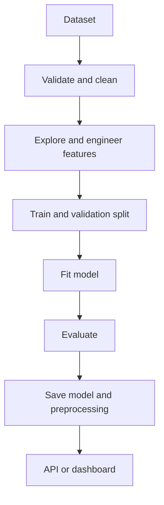

# Python Full Stack with AI — Assessment Projects

[](https://prediction-api-dashboard-hub.neat-grove-8624.chatgpt.site)
[](https://www.python.org/)
[](https://scikit-learn.org/)

Coursework and final-assessment implementations from a Python Full Stack with AI program. The repository demonstrates data preparation, exploratory analysis, machine learning, neural-network forecasting, model evaluation, APIs and user-facing prediction dashboards.

## Live project hub

The [Prediction API & Dashboard Hub](https://prediction-api-dashboard-hub.neat-grove-8624.chatgpt.site) presents four separate workflows:

| Project | Problem type | Typical methods | Output |
|---|---|---|---|
| Heart disease assessment | Classification | Pandas preprocessing, train/test split, scikit-learn classifier and probability | Risk class and confidence |
| Hospital capacity analysis | Regression | Data cleaning, feature selection, regression and error metrics | Capacity or demand estimate |
| Healthcare stock forecasting | Time series | Sequence preparation and TensorFlow/Keras recurrent network | Forecast curve and model summary |
| FDA device forecasting | Time series | Historical aggregation, supervised sequences and forecasting | Forward projection and trend view |

## Learning objectives

- Load, inspect and clean structured datasets with NumPy and Pandas
- Separate input features from prediction targets
- Encode, scale and split data correctly
- Train classification and regression models with scikit-learn
- Build recurrent forecasting models with TensorFlow/Keras
- Measure performance with task-appropriate metrics
- Save and load trained models safely
- Expose predictions through FastAPI or Flask
- Present inputs and results in HTML/CSS/JavaScript dashboards

## Reproducible workflow



## Getting started

```bash
git clone https://github.com/safdar404/Fullstack-AI-BOOTCAMP-B-10.git
cd Fullstack-AI-BOOTCAMP-B-10
python -m venv .venv
pip install numpy pandas matplotlib seaborn scikit-learn tensorflow fastapi uvicorn flask
```

Run individual solutions from the repository root so relative dataset paths resolve correctly.

## Portable file paths

Avoid hard-coded user directories. Build paths relative to each script:

```python
from pathlib import Path

BASE_DIR = Path(__file__).resolve().parent
data_path = BASE_DIR / "data" / "example.csv"
```

## Model-quality checklist

- Prevent target leakage
- Fit preprocessing only on training data
- Stratify imbalanced classification where appropriate
- Report precision, recall, F1 and confusion matrix with accuracy
- Use MAE/RMSE for regression and forecasting
- Save preprocessing with the trained model
- Validate API input ranges
- Label demonstration predictions clearly

## Responsible-use notice

The healthcare, hospital, stock and FDA interfaces are educational demonstrations. They are not medical diagnoses, investment advice, regulatory forecasts or operational hospital-planning systems. Real deployment requires authoritative datasets, domain review, calibration, security, monitoring and regulatory compliance.

## Author

**Muhammad Safdar**  
[Portfolio](https://safdar404.github.io/) · [GitHub](https://github.com/safdar404) · [LinkedIn](https://www.linkedin.com/in/muhammad-safdar-88b27730)
